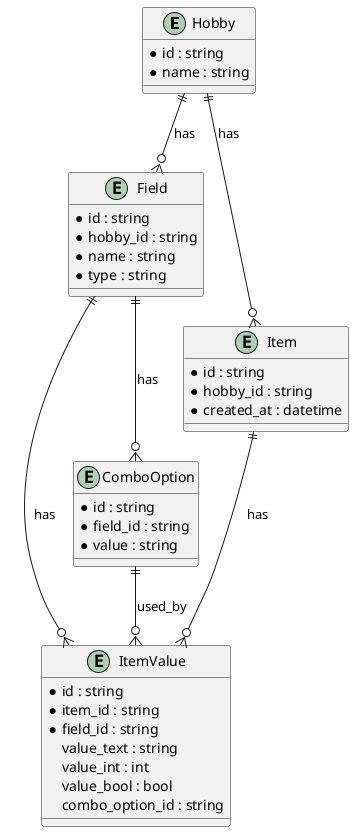

# Instructions.md

## Project Overview
This project is a FastAPI-based hobby manager with a SQLite backend, dynamic field support, and a modern, testable UI. It allows users to manage hobbies, define custom fields (including combo boxes), and add items with flexible data types. All CRUD actions use modal dialogs for a smooth user experience.

---

## Source File Guide

### Root
- **main.py**: FastAPI app entry point. Mounts static files, serves HTML pages, and includes API routers.

### app/
- **database.py**: SQLAlchemy database setup and session management.
- **init_db.py**: (If present) Script to initialize or migrate the database.
- **models.py**: SQLAlchemy ORM models for Hobby, Field, Item, ItemValue, ComboOption.
- **combo_options.json**: (Legacy/optional) JSON storage for combo box options (now handled in DB).
- **hobbies.json**: (Legacy/optional) JSON storage for hobbies (now handled in DB).
- **hobby.db**: SQLite database file.

#### app/routers/
- **root.py**: (If present) May provide root endpoints or health checks.
- **config_sqlite.py**: All main API endpoints for managing hobbies, fields, items, and combo options. Handles all CRUD operations and returns data in frontend-friendly formats.
- **config.py**: (Legacy/optional) JSON-based config endpoints (deprecated).

#### app/schemas/
- **hobby.py**: Pydantic schemas for API validation (Hobby, FieldConfig).

#### app/static/
- **config.html**: Main configuration UI for hobbies and fields.
- **config.js**: JS for config.html, handles hobby/field CRUD and modal dialogs.
- **config.css**: Shared CSS for all static pages.
- **items.html**: UI for managing items for a hobby.
- **items.js**: JS for items.html, handles item CRUD, dynamic forms, and modals.
- **combo_options.html**: UI for managing combo box options for a field.
- **combo_options.js**: JS for combo_options.html, handles combo option CRUD and modals.
- **cartoon picture of a.png**: Favicon.
- **favicon.ico**: (Alias for PNG favicon.)

---

## Database Structure (PlantUML)

---

## How the Pieces Work Together
- **main.py** starts the FastAPI app, serves static HTML/JS/CSS, and exposes API endpoints.
- **config.html/js**: Lets users add/edit/delete hobbies and fields. All dialogs are modals.
- **items.html/js**: Lets users add/edit/delete items for a hobby. Dynamic forms are built from field definitions. Combo fields use a dedicated modal page for option management.
- **combo_options.html/js**: Lets users manage options for combo fields (add/edit/delete options) with modals.
- **config_sqlite.py**: All backend logic for CRUD, always returns data in a frontend-friendly way (e.g., item lists show field names and values, not raw DB columns).
- **models.py**: Defines the DB schema. Items and fields are flexible; combo options are normalized.
- **schemas/hobby.py**: Pydantic schemas for API validation.

---

## Running the Project
1. Install dependencies (see README.md).
2. Run the app: `python main.py` or with Uvicorn.
3. Open `http://127.0.0.1:8000/` in your browser.
4. Use the UI to manage hobbies, fields, items, and combo options.

---

## Notes
- All CRUD actions use modal dialogs for a modern, testable UI.
- The database is SQLite and can be reset at any time.
- Playwright tests are provided for end-to-end validation.
- For more details, see README.md.
